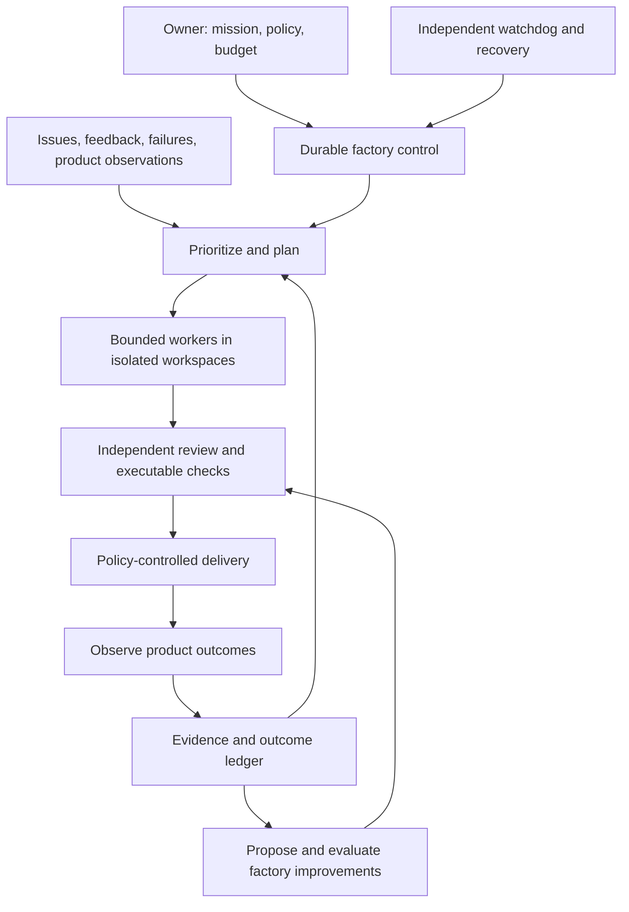

# Software factory — design notebook

Version 0.2 · October 2, 2026 · Discussion draft

The notebook below records the original design assessment. Subsequent implemented
and live-tested results are tracked separately in
[the qualification record](C:/Users/Moe/Documents/ChatGPT/FACTORY/QUALIFICATION.md).

## Confirmed direction

The first mission is **develop and improve FLUJO as the factory platform**.
The primary objective is **development speed**: reduce the time from an accepted
requirement to independently accepted delivery, with explicit quality and cost
constraints. Track accepted-delivery throughput as a complementary measure.

The owner also wants a network of FLUJO instances that can provision further
cloud instances, pursue different problems and competing approaches, communicate,
and monitor each other. The proposed architecture is a federation with delegated
budget and explicit authority; see [the federation design](C:/Users/Moe/Documents/ChatGPT/FACTORY/FEDERATION.md).

The factory should eventually govern its own routine work and improve its
methods. The operating model below is a proposal, not an implemented system or
authorization to resume the paused hackathon workers.

The product promise: an owner gives FLUJO a mission, constraints and a budget;
FLUJO turns them into delivered improvements, checks the results, recovers from
interruptions, and shows what changed and why.

### Related workstreams

| Responsibility | Owner-designated chat | Observed context on October 2 |
| --- | --- | --- |
| User experience / avatar interface | [Plan Fujo’s avatar interface](codex://threads/01a0fe99-5cef-76b2-8a84-67e9ee3f6d71) | Active interface implementation; its avatar/world connects to FLUJO's existing backend capabilities |
| FLUJO development | [Clarify task request](codex://threads/01a0feb8-d78c-7b03-8e13-caae7b35e4fb) | Owner-designated development chat; retrieved history contains only a placeholder and clarification reply |
| Factory operating model and federation | This FACTORY chat | Architecture discussion and design artifacts |

These are ownership/context references. No assignments or messages were sent to
the two linked chats during this design work.

## What the reviewed material establishes

This is an initial synthesis of selected local code, documentation and chats,
not an exhaustive audit of all projects, Slack history or current GitHub state.
No runtime acceptance tests were run for this notebook.

| Asset or observation | What we can reuse or learn | Evidence limit |
| --- | --- | --- |
| FLUJO Roles, Personas, Activities, WorkItems, memory, immutable Behaviors and lease contracts | Durable identity and commitments, temporary execution, provenance, ownership and reversible activation | Local code and architecture contracts; not a new deployment qualification |
| FLUJO Behavior proposals and outcome detector | Candidate revisions, evaluation hooks, frozen outcome policy, activation and rollback | Existing implementation; software-delivery quality and general self-improvement are not established by its presence |
| Existing FLUJO Codex adapter, scheduler, MCP tools and human tickets | Execution, triggers, controlled tools and an operator intervention path | Reuse candidates; check the selected release's actual interfaces before implementation |
| Hackathon coordination, local CI and deployment work | Fresh sessions, isolated source, resource limits, source-pinned evidence and recovery handoffs | Historical results apply to their recorded source and environment |
| October 2 shutdown handoff | All nine Codex automations were paused, owned work stopped, and source/evidence preserved; full customer acceptance was unfinished | Recorded shutdown plus automation-file inspection; not a fresh audit of every external service |
| FLUJO checkout | Considerable existing work and a newer locally cached remote ref | Shared checkout is dirty and behind that ref. Do not choose it blindly as the factory's release baseline |

FLUJO's `enduringAgents/factory.ts` creates Personas; it is not already a complete
software delivery factory. The reviewed learning and runtime mechanisms are
building blocks for this larger system.

## Hackathon lessons to carry forward

1. **Current state must outlive the chat.** The shutdown handoff explicitly
   records an old outage message being treated as new after context recovery.
   Events need identities, observation times, effective times and supersession.
   A fresh worker receives the current mission/control revision and relevant
   evidence, then reconciles reality. Historical prose cannot reactivate work.
2. **Ownership must be enforceable.** Multiple coordinators, schedules,
   worktrees and resource owners required careful reconciliation. One authority
   owns a work item and one writer owns an integration branch. Lease fencing,
   idempotency and explicit handoffs enforce that ownership.
3. **Accepted work and observation are separate.** The gateway acceptance
   contract distinguishes an HTTP timeout from a failed FLUJO conversation.
   On reconnect, find the accepted run before retrying. Unknown completion is
   a reconciliation state, not a reason to launch a duplicate.
4. **Implementation, publication and customer success are separate facts.**
   The release handoff contained merged source, CI passes and a native-provider
   component result while full customer acceptance remained open. Evidence
   must name what it actually proves.
5. **Local verification must turn into a deliverable.** FLUJO's Persona review
   handoff records a delivery correction from local validation to committed,
   pushed and merged work. The declared finish condition must include the
   intended destination and independently observed result.
6. **Resources and interruption are part of the product.** The local CI policy
   has Windows process-tree bounds, Docker limits and exclusive ownership.
   The factory needs admission control, cancellation and verified cleanup.
7. **Preserve the platform boundary.** Hackathon banking behavior belongs in
   the application/MCP or the explicitly isolated branch. General factory
   primitives may belong in FLUJO; project-specific rules belong in project
   configurations, Flows or adapters.

## Three properties, three separate proofs

**Autonomous:** it executes an authorized assignment without repeated steering.

**Self-governing:** it chooses and sequences work within its mission, manages
ownership and budget, handles failure, and enforces its release rules.

**Self-improving:** an explicit change to its tools, instructions or process
produces better independently measured outcomes on comparable work.

Running more agents, changing a prompt, or producing more commits does not prove
the third property. Better results might mean higher task success, fewer escaped
defects, lower cost per accepted result, faster delivery or fewer interventions.
Quality and operating limits constrain the optimization.

## Proposed architecture

### 1. Mission and operating policy

The owner sets the desired product outcomes, exclusions, budget, tool authority,
release rules and intervention conditions. This is an explicit versioned policy,
not a growing system prompt. The factory can propose policy changes; authority
expansion uses a separate governed decision.

The factory may discover defects and suggest features, but they must serve the
mission. When no valuable authorized work remains, it waits. It does not invent
work merely to stay active.

### 2. Durable control

A small deterministic service owns authoritative work transitions, leases,
budgets, pause state and delivery eligibility. Model-driven planners propose
actions; the service validates and records them.

Reuse FLUJO's WorkItems, Activities, Behaviors and ownership machinery where they
fit. Add generic records only for concrete gaps. Keep one logical authority for
each state domain; dashboards and summaries are projections, not competing
writable truth stores. In a federation, cells own their local state while shared
delivery ownership and resource allocations use an authoritative coordination
service. Replication must preserve that authority rather than introduce multiple
independent writers for the same shared decision.

Each work item has:

- The problem, beneficiary, scope, exclusions and observable acceptance criteria.
- Mission/policy revision, dependencies, owner, budget and deadline if relevant.
- Source baseline, candidate revision, execution attempt and workspace identity.
- Evidence references, review decision, delivery target and recovery action.

A possible lifecycle is `proposed → ready → running → review → verified →
delivered`, with explicit blocked, failed, cancelled and paused states. Workflows
declare whether delivery means a reviewable PR, merged source or an observed
release. A worker's report cannot set a stronger result than the evidence allows.

All inputs have idempotency keys. Ownership epochs fence late workers. A pause
advances the control epoch, stops new dispatch, revokes further mutation authority
and waits for owned work to quiesce. Resuming creates a new explicit control event.
The exact enforcement for external Git/process operations needs design; a
Persona-state fence alone cannot prevent every external side effect.

### 3. Bounded execution

Responsibilities include planning, implementation, review, release and evaluation.
These do not require a permanent agent for each function or a model call on each
scheduler tick. Start with one implementation writer and a separate verifier;
parallelize independent work only when ownership and resources permit it.

Workers receive a compact task packet and access to supporting evidence. Their
context is temporary; their commitments and artifacts persist. Rotate sessions
at task boundaries or when needed for context quality, not merely because an
interval elapsed. Save a recoverable source checkpoint before handoff.

Use the existing FLUJO execution adapters first. Keep provider/session behavior
behind adapters so factory state is not owned by the desktop chat or one model.
Official Codex App Server documentation exposes thread, turn and event primitives;
actual adapter selection and host/authentication suitability remain implementation
questions, not assumptions in this draft.

### 4. Verification and delivery

Define the acceptance contract before implementation. Verify the exact candidate
and record test environment, input/data version and evidence scope. The verifier
has access to the requirements and source rather than relying on the builder's
summary. An independent model review is useful, but executable and observed
product evidence remain necessary.

Choose checks proportionate to the change under an explicit policy. Reuse valid
unchanged evidence when that policy permits it; do not repeat broad audits without
a new reason or weaken required checks to clear a blockage. Separate diagnostic
checks, source CI, staging behavior and production observation.

Make routine delivery autonomous within pre-authorized rules. Escalate concrete
exceptions with a prepared decision packet. Proposed initial rollout: autonomous
implementation, review and staging; graduate eligible merge/release classes after
the first delivery and recovery proofs. Exact release authority is still open.

### 5. Measured improvement

There are two coupled loops:

- **Product loop:** identify a FLUJO problem, implement a fix, verify it, deliver
  it and observe the product result.
- **Factory loop:** identify a repeated delivery failure, propose a method
  change, compare it against the current method, activate a better revision,
  observe it and roll back a regression.

Initial improvements can change task decomposition, context retrieval, Flow
instructions, tool selection, retry behavior or test selection. Later work can
improve the factory's own code through the same delivery loop.

Every experiment pins a baseline, candidate, task cohort, evaluator version,
resource envelope and promotion rule. Preserve failed trials. Separate developer
examples from protected holdouts and periodically introduce fresh tasks. Compare
outcomes across task types; an easier workload or a provider change can otherwise
look like a process improvement.

The candidate cannot grant itself tools, weaken its release gate, rewrite its
evaluation or redefine success. Evaluator changes are separate reviewed work with
their own compatibility evidence. A learning record is a provenance-bearing
candidate, not automatically an instruction.

FLUJO already has Behavior proposal/evaluation and outcome rollback code. Extend
and qualify those mechanisms for factory outcomes before creating a second
learning system. An Activity self-report is a useful observation; the factory's
quality verdict needs independent acceptance signals. Existing minimum sample
thresholds are operating heuristics, not proof that a measured change is
statistically reliable.

## Improving the system that runs the factory

Keep a known working factory release running while the candidate is built and
tested separately. Promote an immutable artifact at a controlled boundary and
retain a compatible rollback path. A state/schema migration may need recovery
steps beyond reverting the code artifact.

An independent watchdog must still be able to stop dispatch and report failure
when the candidate or model is unhealthy. It should operate outside worker model
loops. Self-improvement does not mean allowing a running agent to overwrite the
only controller, recovery path or evaluator that governs it.

## First experiment: a factory improving FLUJO

Choose one small, useful generic FLUJO defect or improvement with a clear
before/after result. Select a clean source baseline after reconciling existing
work; do not commandeer the shared dirty checkout.

The experiment should demonstrate:

1. Turn the problem into a durable task and acceptance contract.
2. Implement in an isolated workspace and produce a coherent source checkpoint.
3. Independently review and run the required checks against that candidate.
4. Produce the declared deliverable, preserving actual source and review status.
5. Interrupt execution deliberately, recover from durable state in a fresh
   session, and verify no duplicate assignment or external effect.
6. Exercise pause and cleanup; preserve unfinished work without calling it done.
7. Use a measured failure to propose one factory-method improvement and compare
   baseline/candidate on additional comparable tasks before promotion.

A single delivery can prove the loop works. It cannot establish broad reliability
or prove learning across arbitrary software tasks. Expand from a single-project
pilot to repeated work and unattended operation only after the evidence supports
those claims.

## What the owner should see

One factory view showing the current mission, accepted product outcomes, active
work and ownership, reviewable artifacts, released versions, remaining budget,
blocked decisions and measured experiments. Status should distinguish product
progress from coordination activity. Notify on meaningful delivery, failure,
regression or a needed decision rather than every polling round.

Useful initial measures: accepted-task success by task class, cost per accepted
result, time to delivery, escaped defects, human interventions, duplicate effects,
recovery success and the fraction of resources spent on coordination. Report
denominators and uncertainty; tokens, messages and commits are diagnostics.

## Pilot decisions recorded

The owner authorized a total cloud pilot spending cap of **US$100**. The signed-in
Fly account exposes one organization, `personal`, which owns the temporary pilot
resources. The first live slice allowed at most two workers and delegation depth
two, with one bounded Flow call per worker and targeted retirement at the end.
Logical allocations in the controller do not substitute for actual provider
charges. The runner must constrain resource size, runtime and inference attempts,
and preserve any unconfirmed cleanup for reconciliation.

The owner subsequently requested no factory growth limits beyond budget.
Source `72aec7cd64ff7d55ba8c7cb31bf371dee8a88044` implements an explicit trusted
local policy choice: exact factory schema 2 stores
`{schemaVersion:2,mission,budgetCents,growthMode:"budget-only",maxCells:null,maxDepth:null}`.
Missing or malformed ceilings never imply that mode. Parent allocations, grant
monetary ceilings, paid admission, leases and provenance remain enforced.
Models and advisory peers cannot change the policy. The original live controller
is still paused with its legacy policy; see [BUDGET_GROWTH.md](BUDGET_GROWTH.md).

The local recovery pilot is executable in this repository. Its saved evidence at
[the October 2 recovery report](C:/Users/Moe/Documents/ChatGPT/FACTORY/evidence/local-recovery-20261002/report.json)
records real Git mutation followed by process termination before receipt,
positive destination reconciliation, rejected stale authority and one delivered
candidate. Both candidate implementations are fixed fixtures. This qualifies a
local control/recovery mechanism, not model-driven FLUJO development or network
failover. See [README.md](README.md) for reproducible commands and boundaries.

## Decisions still open

- Which primitives support portable cloud workers today, and which must change
  before a worker becomes an autonomous peer factory?
- Which first FLUJO problem gives the clearest and most useful factory proof?
- Which routine merges/releases are pre-authorized, and what evidence is required?
- Which FLUJO primitives already satisfy the work/control contract at the selected
  baseline, and which generic gaps need implementation?
- What resource budget, host availability and interruption targets define v0?
- Which independent product tasks and acceptance judgments form the evaluation set?

## Local evidence reviewed

- [FLUJO foundation contracts](C:/Users/Moe/Documents/GitHub/FLUJO/docs/architecture/enduring-agent-foundation-contracts.md)
- [Behavior learning](C:/Users/Moe/Documents/GitHub/FLUJO/src/backend/services/enduringAgents/behaviorLearning.ts)
- [Behavior outcomes](C:/Users/Moe/Documents/GitHub/FLUJO/src/backend/services/enduringAgents/behaviorOutcome.ts)
- [Outcome policy](C:/Users/Moe/Documents/GitHub/FLUJO/src/backend/services/enduringAgents/behaviorOutcomePolicy.ts)
- [Persona review and delivery handoff](C:/Users/Moe/Documents/GitHub/FLUJO/docs/audits/2026-09-21-persona-review-handoff.md)
- [Runtime acceptance scope](C:/Users/Moe/Documents/GitHub/FLUJO/docs/performance/persona-runtime-soak-acceptance.md)
- [Hackathon product boundary](C:/Users/Moe/Documents/GitHub/factored-hackathon-2026/docs/FLUJO_PRODUCT_BOUNDARY.md)
- [Hackathon supervision](C:/Users/Moe/Documents/GitHub/factored-hackathon-2026/docs/HACKATHON_SUPERVISION.md)
- [Local CI policy](C:/Users/Moe/Documents/GitHub/factored-hackathon-2026/docs/LOCAL_CI.md)
- [Recorded October 2 pause and release handoff](C:/Users/Moe/.codex/visualizations/2026/10/01/01a0f97d-c4fa-7d51-bf5c-50edd8e7b1f4/manual-release/SESSION_HANDOFF_PAUSED.md)
- Selected coordination chats: `2h - FLUJO team coordinator`, `Inspect deployment
  and progress`, `1h - PR review automation`, and `24h - Fly deployment`.
- [Official Codex App Server documentation](https://learn.chatgpt.com/docs/app-server).
