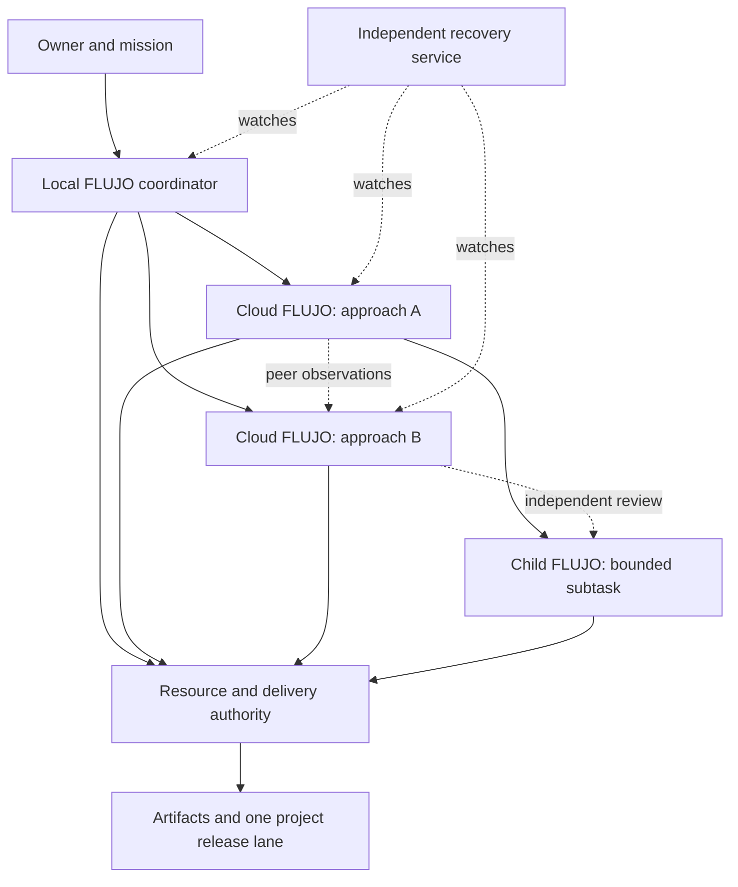

# FLUJO development federation

Version 0.1 · October 2, 2026 · Architecture proposal

## Direction

The factory's first product is FLUJO. Its primary objective is development speed:
time from an accepted requirement to an independently accepted result, subject to
quality and resource constraints. Accepted results per day provide a complementary
throughput measure. Compare task classes and include review, integration and rework.

The owner's larger vision is a network of FLUJO instances that can deploy further
cloud instances, work on separate problems or competing approaches, communicate,
and monitor one another. This document extends the
[factory notebook](C:/Users/Moe/Documents/ChatGPT/FACTORY/FACTORY_DESIGN.md).

## A cell is a complete local work system

A proposed factory cell is an independently deployed FLUJO instance with an
identity, an authorized mission, durable local work, execution capacity, evidence,
and a recovery path. It can run Personas and temporary workers. It may request a
child cell when the expected delivery benefit justifies the allocated resources.

Cell identity, Persona identity, model session and infrastructure instance identity
remain distinct. Cross-host Persona continuity needs a separate ownership
protocol; copying a workspace does not establish that continuity.

Two instances help with availability only to the extent that their hosts, state,
credentials and recovery paths are independent. Several cells sharing a single
machine, storage service or inference account retain those common dependencies.

## Two structures in the same network

**Delegation tree:** mission, task scope, budgets and tool authority flow through
explicit parent-to-child allocations. Delegation is accountable and bounded.

**Peer connections:** cells exchange work offers, artifact references, reviews,
health observations and recovery requests. Peers can cooperate across the tree.
Peer communication does not grant ownership of another cell's work or accounts.

Solid parent/child links express delegation. Dotted links express observation and
cooperation. The resource/delivery authority is logically authoritative for its
shared decisions; its implementation may be replicated. This drawing is not a
claim that a single service process is sufficient for high availability.

## How recursive deployment should work

A cell requests capacity through a provisioning interface. The request names the
delegated mission/task, immutable FLUJO/template revision, permitted host class,
allocated budget, expiry, resource limits and delegation depth.

The admission service reserves resources before deployment. Count pending as well
as running instances. Use one durable deployment key and reconcile actual provider
identity after an interrupted response. A lost acknowledgement must not create a
second worker.

Children receive scoped credentials and an allocated portion of the budget. A
parent cannot spend the same reserved allocation again. A child can redelegate
only the permitted remainder; it does not inherit the parent's complete accounts.
Inference, storage and compute admission need enforceable service boundaries,
including bounded in-flight work and reconciliation of actual costs.

A lifecycle could be `requested → reserved → provisioning → enrolled → ready →
working → draining → stopped`, with explicit unknown, failed and quarantined
states. Enrollment verifies the runtime/template version and instance identity
before accepting work. Expiry disables new actions and triggers owned-resource
reconciliation, evidence preservation and teardown according to policy.

Recursive capacity is useful when it shortens the critical path or enables a
valuable experiment. Start with a small fleet and a depth limit. The scheduler
should also shrink idle capacity and account for provisioning/setup time.

## Talking is a durable protocol

Chat can carry explanations, but assignments and ownership need structured
records. Initial message families can be work offer/acceptance, checkpoint,
review result, health observation, recovery request and capacity request.

An envelope carries message/idempotency ID, authenticated sender, intended
recipient, project/workspace, task/attempt, causal parent, policy revision,
ownership epoch, observation time, expiry and artifact references as applicable.
Acknowledgements and an outbox/inbox permit retry without duplicate dispatch.

Use artifact references and compact changes rather than broadcasting complete
conversation histories. Preserve input provenance and confidentiality. A remote
peer's narrative is data; it cannot become an instruction or permission merely
because a trusted transport delivered it. Accept review evidence under a defined
verifier policy, not a count of agreeing peers.

The first native capacity interface is now implemented through a private MCP
tool and the authenticated peer gateway. Source `56a2048` passed **358/358**
complete checks plus actual native worker/ExecutionEngine acceptance with a
synthetic model and injected executor. A Flow requests capacity; a trusted local
standing grant binds its exact task/peer generation, template, quotas and expiry.
The broker atomically admits the child and effect, then applies actual local paid
admission before ManagedCloud dispatch. Lost-ACK/store/worker restart preserves
one original intent; a fully held fixture budget refuses another dispatch.
See [NATIVE_CAPACITY.md](NATIVE_CAPACITY.md). This does not establish deployed
child enrollment, independent ownership/backlog, autonomous schedules or paid
inference; those remain separate native-cell requirements.

The first implemented transport is now the separate advisory peer gateway in
[PEER_MESSAGING.md](PEER_MESSAGING.md). It persists sender intent, authenticates
the identity pair and credential generation, commits a deduplicated inbox before
acknowledging, and retries the exact original body/destination after a lost ACK.
Its 11 focused checks include real receiver termination and both-process restart.
Messages grant no work/control authority. A subsequent parent-orchestrated pilot
used two actual local CLI gateways to exchange persisted controller, budget and
Modal-journal observations in both directions, then confirmed both gateways had
closed with source/accounting witnesses unchanged. This establishes local
protocol recovery and advisory integration; deployed peers and independently
hosted failover still need acceptance. Exact evidence is in
[QUALIFICATION.md](QUALIFICATION.md).

Automatic mutual watching is now implemented and locally qualified in source
`26c8cc4637a8f89c2f4a83092cb5d35f735794fc` (**335/335** complete checks). Two native
`peer watch` processes continuously probe each other's authenticated health and
read-only controller/paid projection. Meaningful changes persist atomically in
the existing outbox; restart automatically retries the exact original message.
The actual rehearsal confirms quiet unchanged polls, a native change, peer outage
and both-process restart after an inbox commit with a lost ACK. Revision floors
survive interruption and regressed current state becomes unavailable. This is
same-host advisory recovery; deployment across independent hosts and automatic
native enrollment still need acceptance. Exact evidence is in
[QUALIFICATION.md](QUALIFICATION.md).

## Watching is separate from taking over

A watcher reports a missing heartbeat, failed readiness check or stalled task.
The observation is not proof that the old worker has stopped. A coordination
service grants a successor a new ownership epoch before shared mutation resumes.

Enforce that epoch at the boundary for publishing, merging, deployment and
provisioning. A local database fence cannot stop an old worker that still has
unrestricted credentials for an external service. Worker credentials should
therefore reach controlled delivery/provisioning gateways for those effects.

For operations whose outcomes are unknown, inspect the accepted job and external
result before retrying. A reconnect should recover progress rather than create a
new task. Retain unfinished evidence and explicit uncertainty.

Use sparse peer watches plus an independent rescue service. Ordinary heartbeat
checks are deterministic; invoke a model when there is a concrete problem to
diagnose. Watchdog software must remain usable when the worker's model or candidate
FLUJO release fails.

## Parallel problems and competing approaches

For independent problems, give cells distinct tasks and branches. For an uncertain
problem, explicitly commission a limited number of competing approaches from the
same baseline and acceptance contract. Each approach owns its branch and resource
allocation.

A verifier compares correctness, delivery complexity, performance and actual
cost/time against the common requirements. One project integration owner selects
and integrates an eligible candidate. Preserve rejected approaches and their
useful findings without merging competing changes indiscriminately.

Parallelism helps only if verification and integration can keep up. Keep work in
progress and candidate counts bounded; avoid generating more branches than the
release lane can evaluate. Reuse qualified unchanged artifacts when allowed by
the project's verification policy.

## Behavior during failures

| Failure | Proposed response |
| --- | --- |
| Parent coordinator offline | Children continue already admitted isolated work within reserved authority; shared decisions require available authoritative services |
| Worker offline or partitioned | Record suspicion; reconcile accepted work and ownership before reassignment; reject stale shared mutations |
| Coordination service unavailable | Continue permitted isolated development; hold new shared ownership, capacity allocation and delivery decisions |
| Inference provider unavailable | Preserve state; use a pre-qualified alternate if allowed, or wait; record provider changes in comparison evidence |
| Shared storage unavailable | Do not claim checkpoints or results were durably published; preserve permitted local recovery material |
| Provisioning response lost | Resolve the original request and actual resource before any retry |
| Candidate FLUJO regression | Stop fleet promotion; retain known working cells and apply the tested recovery/rollback path |

Availability comes from bounded local independence and recoverable shared services.
Replicating model coordinators without a shared ownership protocol would introduce
competing decisions for the same release or budget.

## Learning across the network

Cells publish measured experience with provenance: task class, source/template,
tools/model, evaluation version, workload, outcome and resource cost. Other cells
can propose adopting that improvement. Activation is an explicit revision change
under the existing learning policy.

Compare candidate methods on comparable tasks and retain failed experiments.
Model self-reports and peer agreement are insufficient acceptance evidence. Keep
protected evaluations distinct from examples used to improve the candidate.

Roll out a factory change to a limited canary first. Preserve cells on a known
working version and keep the rescue service outside simultaneous candidate
upgrades. State migrations need an explicit compatibility and recovery plan.

## Existing foundation and the important boundary

The read-only asset review inspected the dirty local FLUJO checkout and the
separate clean `flujo-cloud` checkout at `c36ceef`. The cached newer FLUJO remote
ref is context, not a claim about the currently deployed fleet.

The local source audit found a portable workspace-snapshot cloud-worker path in
[Hot-clone workspace](C:/Users/Moe/Documents/GitHub/FLUJO/docs/features/hot-clone-workspace.md).
Its documentation delegates Fly lifecycle, tunneling, forwarding and teardown to
a separate `flujo-cloud` bridge and validates worker compatibility.

The bridge already exposes a shared `ManagedCloud` application service with
`sources`, `workspaces`, `preflight`, `up`, `call`, `list` and `down`. Its `up`
operation records a durable attempt before provisioning, pins a compatible image,
and binds credentials to the deployment journal. `call` forwards an existing Flow
request. These are concrete foundations for a factory provisioning capability.
See [the cloud architecture](C:/Users/Moe/Documents/GitHub/flujo-cloud/docs/architecture.md)
and [ManagedCloud](C:/Users/Moe/Documents/GitHub/flujo-cloud/lib/managed.mjs:253).

The bridge exposes CLI/application-service operations. The factory adds a private
MCP capacity tool, authenticated peer inbox and controller-admitted adapter.
`list` still reports local inventory/journal state, not live fleet health; there
is no fleet scheduler or later workspace synchronization. An explicit private
`sourceProfileFile` now binds an authenticated loopback worker's workspace,
archive and compatibility identity in a container namespace. Original desktop
discovery retains its existing identity checks. The new source binding does
not enroll a remote cell or supply a shared remote control authority.

Its worker mode deliberately suppresses scheduler catch-up, Persona dispatch and
remote-task resume. This is appropriate for a delegated execution snapshot. An
autonomous factory peer needs its own enrollment, ownership, authorized schedules,
backlog and child-provisioning contract. Do not enable cloned schedules to create
that peer accidentally.

The local assigned-mission slice is now qualified at source
`a05ae09e7faeba40d8d24470a924cf9e4b4b5f49`: authenticated native preparation,
provision-bound enrollment/claim, one durable Flow POST and original-result
recovery after controller and worker restart. Its fresh native acceptance used
one fixture-model invocation; the provisioning record was also a fixture. It
does not yet provide a deployed peer's independent backlog or planner, or prove
Modal-backed inference. Native worker startup still suppresses cloned schedules.
See [NATIVE_MISSIONS.md](NATIVE_MISSIONS.md) for the runnable private dispatcher
and exact limits.

The native cell queue is now qualified at source `8ef36348f04d0a4a452acd75c493fb1cffa3c97c`.
Its daemon consumes explicitly assigned backlog through one authoritative
controller/paid ledger, serializes same-cell claims, and recovers original results
after restart without another POST. New work after startup and paused recovery
passed with real daemon/native processes, one fixture-model call and no paid run.
This supplies a coordinator-side execution loop, not an independent cloud planner.
Remote deployment still needs a supervisor, compatible Node runtime and
authenticated shared authority; duplicating SQLite ledgers would not preserve
the global spending cap. See [NATIVE_CELLS.md](NATIVE_CELLS.md).

FLUJO's existing local WorkItems, leases, Behaviors, learning mechanisms and remote
execution are candidates for reuse. Cross-host ownership, network task exchange,
fleet budgets and recovery need explicit qualification before claiming a
federation works. This is a read-only architectural assessment, not a new runtime
acceptance result.

The reviewed Persona lock contract is local multi-process coordination, not
cross-host consensus. Remote MCP task polling can resume observation against a
matching server identity, but its documented restart path does not retrieve and
deliver results after the originating run is gone. These existing mechanisms
cannot substitute for a durable cross-cell work/result protocol. See
[the local lease boundary](C:/Users/Moe/Documents/GitHub/FLUJO/docs/architecture/enduring-agent-foundation-contracts.md:52)
and [remote task recovery](C:/Users/Moe/Documents/GitHub/FLUJO/src/backend/services/mcp/remoteTaskResume.ts:3).

Established background patterns include lease-based coordination and durable
workflow history/recovery. Kubernetes documents leases for heartbeats and leader
election; Temporal documents recovery from recorded workflow history. These are
references for the required properties, not a decision to adopt either stack.
See [Kubernetes leases](https://kubernetes.io/docs/concepts/architecture/leases/)
and [Temporal durable execution](https://docs.temporal.io/temporal).

## First federation experiment

The first partial live delegation proof has now passed: real parent/child FLUJO
workers, coordinator-mediated child admission, independent review, owned teardown
and a separate same-host provider witness. It does not yet qualify the full
experiment below. Exact evidence and remaining scope are in
[the qualification record](C:/Users/Moe/Documents/ChatGPT/FACTORY/QUALIFICATION.md).

1. Select one bounded FLUJO improvement and a common acceptance contract.
2. Provision one cloud development cell and an independently hosted watcher,
   with fixed instance limits, allocated resources and expiry.
3. Let the local and cloud cells implement two explicitly different approaches
   on separate branches. A separate verifier evaluates the candidates.
4. Use one integration owner to produce the declared delivery artifact.
5. Interrupt the parent, lose a deployment acknowledgement and temporarily
   disconnect a worker. Verify recovery, owned cleanup and rejection of stale
   publication without duplicate resources, assignments or releases.
6. After those proofs, allow the cloud cell to provision one further child under
   the same admission contract with a maximum delegation depth of two.

Measure end-to-end delivery time, accepted outcome, compute/inference cost,
coordination overhead, recovery time and duplicate effects. Compare with a
single-cell run on comparable tasks. Passing the experiment demonstrates a
bounded topology, not arbitrary scale or universal unattended reliability.

## Container service qualification

Source `fea3d151c1a4380495094744d00a33770b1abbb5` packages native-cell and
capacity-broker roles over one private authority. The complete suite passed
**433/433**; the later isolated Docker-fixture delta received final-image
acceptance. A bound native source exported its workspace and a second worker
restored model/MCP/Flow configuration with due schedules dormant. The expected
MCP tool was listed on both workers without invocation. Full fixture budget
refusal retained one `not_applied` provision intent across broker restart.
Separate native-cell acceptance recovered one original POST and synthetic-model
result with GET while paused; its next task stayed ready without effects.
All owned fixture resources were removed. Build revision remains part of the
immutable worker identity. See [the service guide](deploy/factory-service.md)
and [broker guide](deploy/factory-service.broker.md). This proves local snapshot
restore and admission/restart behavior; successful Fly provisioning, recursive
enrollment, remote shared authority and paid Modal inference remain open.

One authoritative coordinator owns controller, paid admission and durable
mission outputs. Its native companion shares loopback networking and has a
separate workspace volume. Container qualification supplies a runnable local
service bundle; it does not authorize independent copies of the paid ledger or
provide a remote authority protocol. The explicit private source profile supports
container discovery without desktop PID or registration assumptions. Recursive
provision-to-cell registration, independent-host recovery and comparable
delivery-speed measurements remain open.
